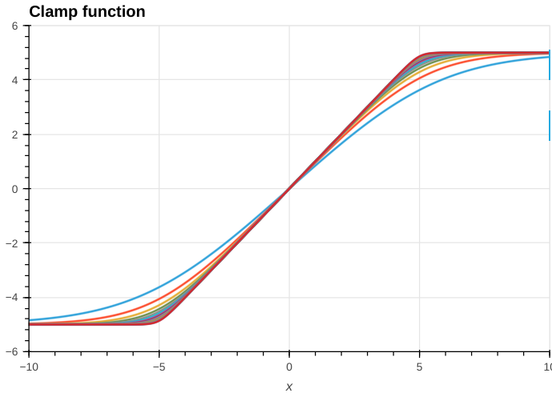
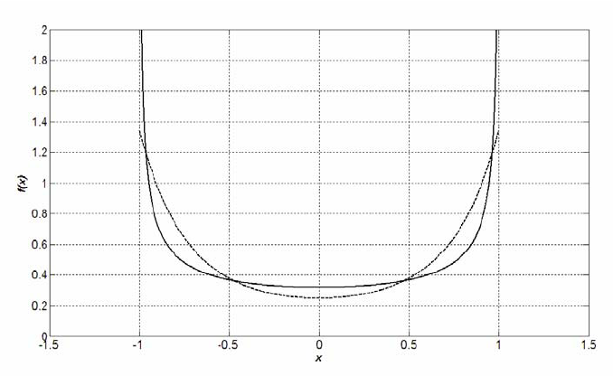

# Innovation track submission

This directory contains our team's submission for the innovation track. Here, you'll find our model architectures along with the README file included in the submission. Please note that this directory does not include model weights or experimental scripts.

Original README:

# Stateful RNN for Energy Spot Market Trading

## 1. Overview

Our solution is a custom Stateful Recurrent Neural Network (RNN) augmented with a hold gate mechanism to adjust the final action.

## 2. Data Preparation

We used non-missing data from `training_data.csv` of the following columns: `timestamp`, `price`, `demand`, `pv_power`, `pv_power_forecast_1h`, `pv_power_forecast_2h`, `pv_power_forecast_24h`, `pv_power_basic`.

The dataset spanning from `01-Mar-2023` to `06-Nov-2023`.

**Normalization**: To prevent network instability, we applied Quantile and Power Transformer to price data into a more normally distributed format. Following this, all data underwent MinMax scaling to make it fell within the range of -1 to 1.

**Feature engineering**: Along with original features, we add time of the day, day of the week and peak hour indicator define as:

```
hour = dat["timestamp"].dt.hour
weekday = dat["timestamp"].dt.weekday
fraction_of_day = hour + dat["timestamp"].dt.minute / 60
fraction_of_week = weekday + fraction_of_day / 24
pos_code_day = np.stack(
    [
        np.sin(2 * np.pi * fraction_of_day),
        np.cos(2 * np.pi * fraction_of_day),
    ],
    axis=1,
)
pos_code_week = np.stack(
    [
        np.sin(2 * np.pi * fraction_of_week),
        np.cos(2 * np.pi * fraction_of_week),
    ],
    axis=1,
)

plus_10 = pd.Timedelta(hours=10)
timestamp = timestamp + plus_10
is_peak = (timestamp.dt.hour >= peak_lower) & (timestamp.dt.hour < peak_upper)
```


## 3. Machine Learning Model

### 3.1 Strategy Overview

In this hackathon, our objective is to develop an optimised battery storage and energy trading policy based on observed energy price and local solar energy production trajectories such that the overall profit is maximised.

Generally, there could be three main classes of strategies: direct optimisation of the objective function, reinforcement learning (RL) and model predictive control (MPC). We believe MPC is unsuitable for our scenario because MPC relies on predicting one or more likely future scenarios and find an optimal strategy over predicted scenarios, but both the future energy price and local solar power production (which relies on local weather) can be highly volatile and unpredictable. We believe both RL and direct optimisation is viable, but assuming direct optimisation is possible, it is significantly easier to implement. Therefore, we chose to use a direct optimsation approach to tackle the problem.

Our overall strategy is to first define a differentiable loss function that matches (or closely resembles) the real optimisation objective (maximisating profit within battery capacity and charging rate constraints), use a recurrent neural network (RNN) model to summarise historical system states (which include price, solar power production and battery charge state), output an estimated optimal action based on the RNN outout, run through a differentiable battery simulator to obtain accumulated profit, then use back-propagation to optimise the RNN model.

The key challenge of implementing this strategy is to turn the external battery simulator, which only produces non-differentiable objective values, to a fully differentiable one that can back-propagate losses to the action outputs of a neural network model. We achieved this by replicating the gist of the battery simulator in PyTorch, and verify that it is indeed able to produce the exact battery state and profit trajectory as the original battery simulator.

#### Advantages of Our Strategy

1. Simplicity - The model can be trained with simple back-propagation optimisation, without advanced optimisation and tuning techniques. It can be easily retrained on new data (e.g. different states, different local weather or different time periods).
2. Efficiency - The model is under 2MB in size and only requires evaluating a small, shallow neural network for each action prediction step, making it possible to be deployed to less powerful hardware, such as SoCs managing home battery systems.
3. Adapatibility - The model is able to integrate information from not only just price / solar power trajectories, but also their daily / weekly cyclic patterns, different pricing between peak vs off-peak hours, and current battery charge state. As a result, the model will try to take optimal actions under vastly different scenarios.
4. Minimal Clearly Suboptimal Outputs - We penalised our model for outputting non-sensical actions, such as buying from the grid while simultaneously outputting solar power. This ensures that our model does not output actions that are obviously not optimal.

#### Making It Work on Real Batteries

In this hackathon, we made many idealised simplifications about the battery, such as 100% efficiency, fixed charging and discharging rate, no need to consider battery wear, etc. In reality, we do have to consider these issues. After all, an optimal battery control policy should adapt to the characteristics of the actual battery. Moreover, battery life conservation is both an important part of the profitability equation, and a key challenge in our transition to a low-carbon economy. Fortunately, our model is adaptive enough that these concerns can be addressed with small modifications to our current algorithm.

#### Adapting the Model Battery Simulator to a Real Battery

For the hackathon, we assumed the battery has 100% efficiency both for charging and discharging. A real Li-ion battery might have an efficiency around 95%, meaning we cannot take out as much energy as we put in. We can emulate this effect by directly applying a discount factor on the energy we take out from the battery within battery simulation, and carry the computation forward.

We also assumed the charging / discharging rate of a battery is constant. This is not the case for real batteries. They may charge faster when nearing empty but much slower when nearing full capacity. For instance, at some point, we may wish to charge the battery at 5kW, but we are only able to achieve a charge rate of 2kW. This is not difficult to incorporate in our model. In fact, we have already implicitly included a version of it as an optimisation trick!

We can imagine the capacity of the battery as a value that is clamped between zero and its maximum capacity (e.g. 13kWh). If we try to charge it above its maximum capacity or discharge below its minimum, it will "reject" the excess or deficit. If we plot this "intended charge state vs realised charge state" graph, it is a piecewise linear function that is a line of slope 1 on [0, 13], and flat everywhere else. A battery with non-constant charge rate have curves instead of straight lines for this graph. We can think of the battery state as being "soft-clamped" between 0 and 13. If you are at 12.5kWh and intend to put in 1 kWh more power, rather than being able to go straight to the maximum, the battery may instead only charge you to 12.8kWh and "reject" 0.7kWh, due to reduced charging rate nearing full capacity.

[]

The soft clamp function is useful for allowing gradients to flow through flat parts of the function in back-propagation optimisation, which we already use in our model during training. However, we can also alter this curve to fit the charging and discharging characteristics of a real battery (e.g. using a cubic spline), and directly use this curve in our profit calculation and optimisation.

#### Reducing Battery Wear

Common batteries like Li-ion and LiFeSO4 batteries have limited lifetime cycles before they significantly degrade, with some chemistries more resilient than others. A few factors determine how fast they may degrade, among them the most important and relevant ones are how often we charge and discharge and how often we fully cycle (go from 100% to 0%) the battery. While battery management systems often already take these factors into account, we can still help prolong battery life by building battery protection mechanisms directly into our algorithm, restricting our model from taking actions that might be considered harmful for battery life. Thanks to our model using direct optimisation, such auxiliary objectives can be incorporated into the model simply by adding additional objective function terms.

#### Restricting Deep Cycles

We can prevent the battery state from going too close to 0% or 100% by applying a penalty term to the objective that penalises the model based on how close the battery state goes near capacity limits. For instance, a steep U-shaped function defined on [0, max_capacity] adds additional "cost" for the model to go near capacity limits, forcing the model to stay away from fully charging / discharing the battery except in exceptionally profitable scenarios.

[]

#### Restricting Rapid Switch between Charging and Discharging

We can approximately view the total "life cycle cost" to a battery as the total distance we travel up and down the capacity of the battery, which accumulates more when we quickly alternate beween charging and discharging in a short amount of time. For a battery capacity trajectory produced by our policy, this can be calculated as the sum of absolute distance between all pairs of adjacent points (a.k.a. total variation). Therefore, to restrict our model from rapidly switching between charging and discharging, we may apply a total variation penalty term to the objective function, forcing the model to produce smoother, less fluctuating charge state curves.

### 3.2. Model Architect


**What we tried**

- Reinforcement Learning
- Moving Averages and its variation (both as standalone model and as features)
- Stateless Recurrent Neural Network (RNN)
- Data augmentation, including synthetic data generation and imputations

## 4. Result

[]

## 5. Innovation Model

Detail can be found in submission video.
[reserve_no_gate_rnn_model.py](./reserve_no_gate_rnn_model.py): Minimal battery reserved for potential high demand.
[variation_no_gate_rnn_model](./variation_no_gate_rnn_model.py): Conserving battery lifecycle.
